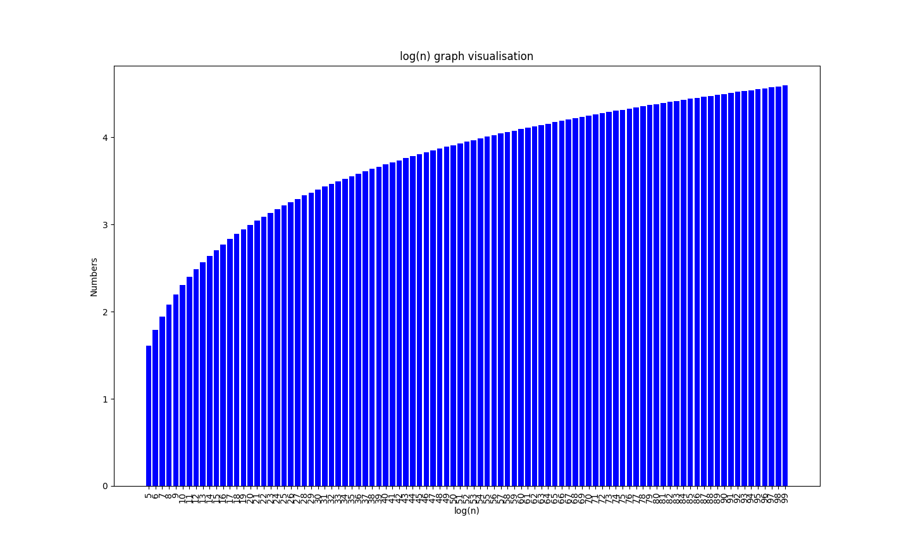
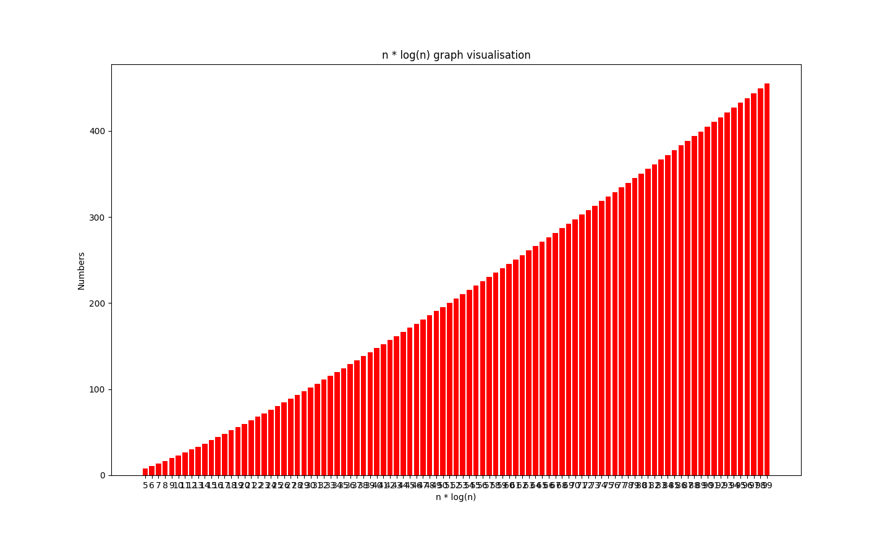
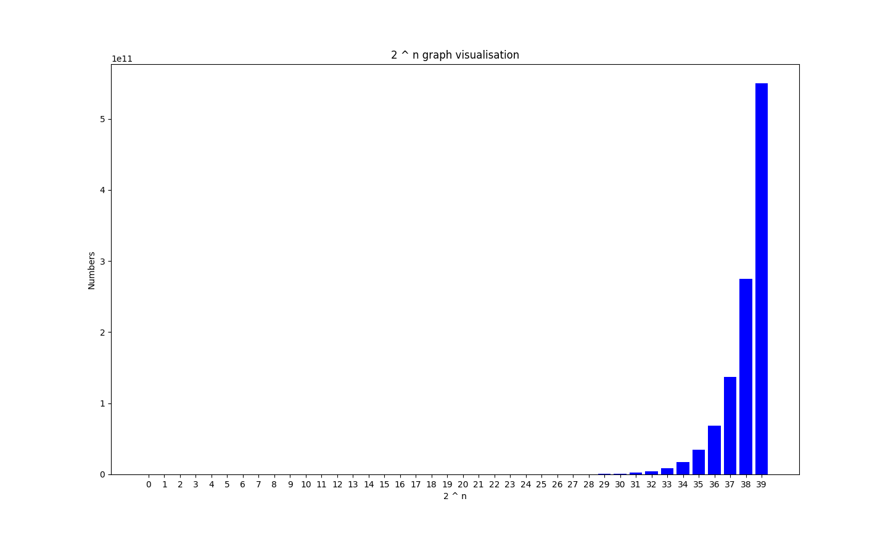
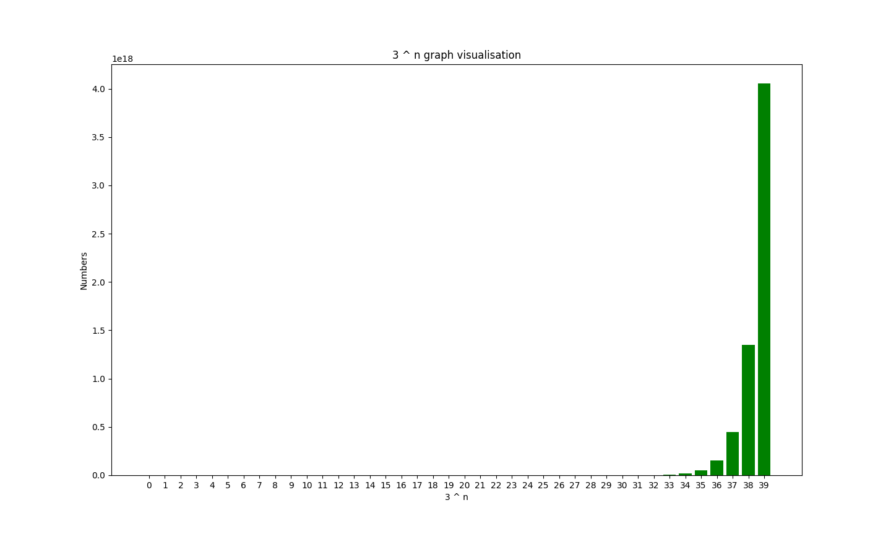
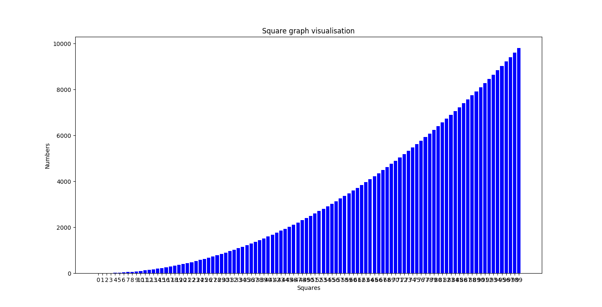
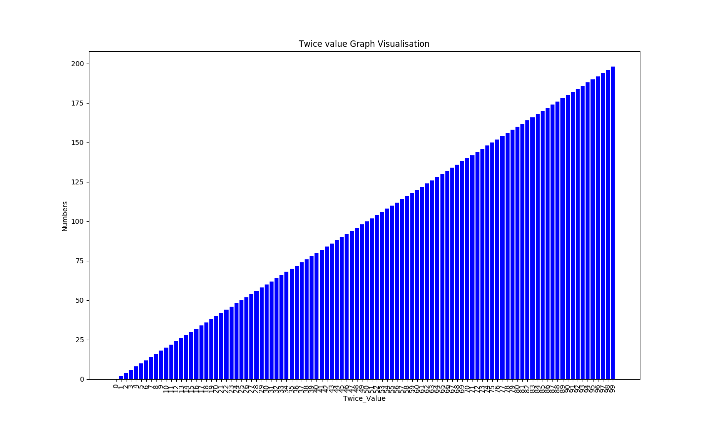

# Time-Complexities

Different time complexities for Understanding Big-oh with matplotlib bar graph visualisations.

1.  N    vs.    log N

2.  N    vs.    N log N

3.  N    vs.    2 ^ N

4.  N    vs.    3 ^ N

5.  N    vs.    N ^ 2

6.  N    vs.    2 * N

7.  N    vs.    N
